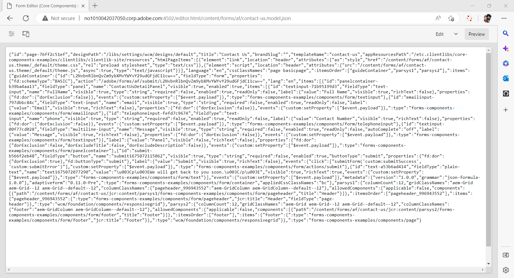

# 使用最適化Forms編輯器建立Headless最適化表單 {#create-a-headless-adaptive-form-using-adaptive-forms-editor}

AEM Formsas a Cloud Service提供好記的編輯器，可建立Headless最適化Forms。 提供超過24個核心元件，在編輯器中拖放元件即可輕鬆建立表單。 此外，規則編輯器可讓您將驗證新增至表單欄位。

>[!NOTE]
>
> 
>如果您不熟悉Headless最適化Forms，Adobe建議您先瀏覽 [使用入門套件建立及發佈Headless表單](create-and-publish-a-headless-form.md) 針對Headless表單使用Adaptive Forms編輯器之前，請接受教學課程，瞭解基本知識並手工Headless最適化表單。

執行以下步驟，使用最適化Forms編輯器建立Headless最適化表單：

## 開始之前:

您需要下列專案，才能使用最適化Forms編輯器建立最適化表單：

**若為AEM 6.5 Forms：**

* 存取AEM 6.5.16.0或更新版本的Forms編寫執行個體。

* 最適化Forms核心元件

* 最適化Forms核心元件範本

* 核心元件型範本的最適化表單主題

* 將您的使用者新增至 [!DNL forms-users] 群組。 [!DNL forms-users] 群組的成員擁有建立最適化表單的權限。

**對於AEM Formsas a Cloud Service：**

* 存取 [AEM Formsas a Cloud Service製作例項](https://experienceleague.adobe.com/docs/experience-manager-cloud-service/content/forms/setup-configure-migrate/setup-forms-cloud-service.html?lang=en) 或 [本機AEM Formsas a Cloud ServiceSDK](https://experienceleague.adobe.com/docs/experience-manager-cloud-service/content/forms/setup-configure-migrate/setup-local-development-environment.html?lang=en) 環境。

* **最適化表單範本**：此範本會提供基本結構並定義最適化表單的外觀 (版面和樣式)。其中具有包含特定屬性和內容結構的預先格式化元件。它也會提供定義主題和提交動作的選項。主題會定義外觀，而提交動作會定義提交最適化表單時要採取的動作。例如，將所收集的資料傳送到資料來源。雲端服務會提供一個名為 blank 的 OOTB 範本：

   * 該 `blank Adaptive Forms (Core Components)` 範本會包含在每個新的 AEM Forms as a Cloud Service 程式中。
   * 您也可以 [建立新的自適應Forms （核心元件）範本](https://experienceleague.adobe.com/docs/experience-manager-cloud-service/content/forms/adaptive-forms-authoring/authoring-adaptive-forms-foundation-components/create-an-adaptive-form-on-forms-cs/template-editor.html) 從頭開始。

* **最適化表單主題**：主題包含元件和面板的樣式詳細資料。樣式包括背景顏色、狀態顏色、透明度、對齊方式和大小等屬性。套用主題時，指定的樣式會反映在對應的元件上。`Canvas` 會包含在每個新的 AEM Forms as a Cloud Service 程式中。

* **權限**：將您的使用者新增到 [!DNL forms-users] 群組。[!DNL forms-users] 群組的成員擁有建立最適化表單的權限。如需特定使用者群組的表單詳細清單，請參閱 [群組與許可權](https://experienceleague.adobe.com/docs/experience-manager-cloud-service/content/forms/setup-configure-migrate/forms-groups-privileges-tasks.html).

## 建立最適化表單  {#create-an-adaptive-form-components}

1. 登入您的 [!DNL Experience Manager Forms] 作者執行個體。

1. 在 Experience Manager 登入頁面上輸入您的認證。登入之後，在左上角點選「**[!UICONTROL Adobe Experience Manager]**」>「**[!UICONTROL 表單]**」>「**[!UICONTROL 表單與文件]**」。

1. 點選「**[!UICONTROL 建立]**」>「**[!UICONTROL 最適化表單]**」。此時會開啟精靈。在「來源」標籤中，選取一個範本：

   

   選取範本時，會自動選取範本中指定的主題和提交動作，且「**[!UICONTROL 建立]**」按鈕已啟用。您可以前往「**[!UICONTROL 樣式]**」或「**[!UICONTROL 提交]**」標籤，選取不同的主題或提交動作。如果選取的範本並未指定主題，則「建立」按鈕將維持停用狀態。您可以前往「**[!UICONTROL 樣式]**」標籤以手動選取主題。

1. 在「**[!UICONTROL 樣式]**」標籤中，選取一個主題：

   * 所選取的範本指定主題時，就會在精靈中自動選取該主題。您也可以從「樣式」標籤中選擇不同的主題。

   * 如果選取的範本未指定主題，您可以使用「樣式」標籤選擇主題。只有在選取主題之後，「**[!UICONTROL 建立]**」按鈕才會啟用。

1. (選用) 在「資料」標籤中，選取一個資料模型：

   * **表單資料模型**：[表單資料模型](https://experienceleague.adobe.com/docs/experience-manager-cloud-service/content/forms/integrate/use-form-data-model/data-integration.html)可讓您將來自分散資料來源的實體和服務整合到最適化表單。如果您建立的最適化表單是對多個資料來源擷取和寫入資料，請選擇「表單資料模型」。

   * **JSON結構描述**： [JSON結構描述](https://experienceleague.adobe.com/docs/experience-manager-cloud-service/content/forms/adaptive-forms-authoring/authoring-adaptive-forms-foundation-components/create-an-adaptive-form-on-forms-cs/adaptive-form-json-schema-form-model.html?lang=en) 最適化表單可提供關聯JSON結構描述的功能，代表正在產生或使用的資料結構，讓您與組織的後端系統無縫整合。 這種關聯可讓作者使用結構描述的元素，動態地將內容新增到最適化表單。在編寫流程中，您可以在內容瀏覽器的「資料模型物件」標籤輕鬆存取結構描述的元素，且所有欄位都會自動新增到任何新建立的最適化表單中。

   根據預設，系統會自動選取相關聯 JSON 結構描述的所有欄位，並轉換成對應的最適化表單元件，進而簡化編寫流程。該精靈提供額外的便利性，讓您透過核取方塊就能選擇性地選擇要在最適化表單中納入哪些欄位。

1. 在「**[!UICONTROL 提交]**」標籤中，選取提交動作：

   * 您選取範本後，系統會自動選取範本中指定的提交動作。您可以從「提交」標籤選取不同的提交動作。「**[!UICONTROL 提交]**」標籤會顯示所有可用的提交動作。

   * 所選取的範本未指定提交動作時，您可以使用「**[!UICONTROL 提交]**」標籤選取提交動作

1. (選用) 在「**[!UICONTROL 傳遞]**」標籤中，您可以為最適化表單指定發佈或取消發佈日期。

1. 點選「**[!UICONTROL 建立]**」。此時會顯示一個對話框，以指定標題、名稱和儲存最適化表單的位置：

   * **[!UICONTROL 標題：]**&#x200B;指定表單的顯示名稱。標題有助於在 [!DNL Experience Manager Forms] 使用者介面中識別表單。
   * **[!UICONTROL 名稱：]**&#x200B;指定表單的名稱。存放庫中會建立具有指定名稱的節點。您開始輸入標題時，就會自動產生名稱欄位的值。您可以變更建議的值。名稱欄位只能包含字母數字字元、連字號和底線。所有無效的輸入都會以連字號取代。
   * **[!UICONTROL 路徑：]**&#x200B;指定最適化表單的儲存位置。您可以將最適化表單直接儲存在 `/content/dam/formsanddocuments`，或建立一個資料夾 (例如 `/content/dam/formsanddocuments/adaptiveforms`) 以儲存最適化表單。要使用路徑中的資料夾之前，請務必先建立該資料夾。「**[!UICONTROL 路徑]**」欄位不會自動建立資料夾。

1. 點選「**[!UICONTROL 建立]**」。此時已建立最適化表單，並在最適化表單編輯器中開啟。編輯器會顯示範本中可用的內容。視最適化表單的類型而定，出現在相關聯 <!--XFA form template, XML schema or -->JSON 結構描述或表單資料模型中的表單元素，會顯示在側邊欄「**[!UICONTROL 內容瀏覽器]**」的「**[!UICONTROL 資料模型物件]**」標籤中。您也可以拖放這些元素以建置自己的最適化表單。

現在，您可以將最適化Forms元件拖放至最適化Forms容器來設計和建立表單。

## 檢視最適化表單的JSON轉譯 {#preview-form}

選取最適化表單並點選 **預覽**. 表單預覽隨即出現。 若要檢視表單的表單定義(JSON)，請將URL中的.html副檔名取代為.model.json

例如， http://[author-server]：[連線埠]/editor.html/content/forms/af/contact-us.model.json

您可以使用Headless最適化Forms [getForm](https://opensource.adobe.com/aem-forms-af-runtime/api/#tag/Get-Form-Definition) 用於擷取表單定義(JSON)並將其用於您的應用程式的API。

