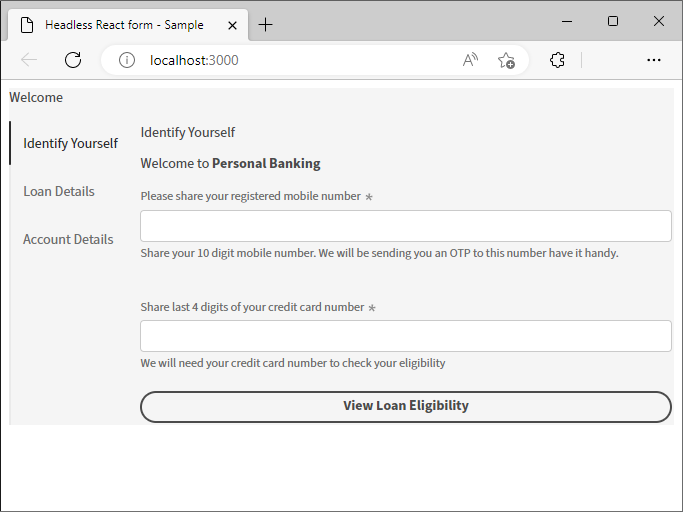
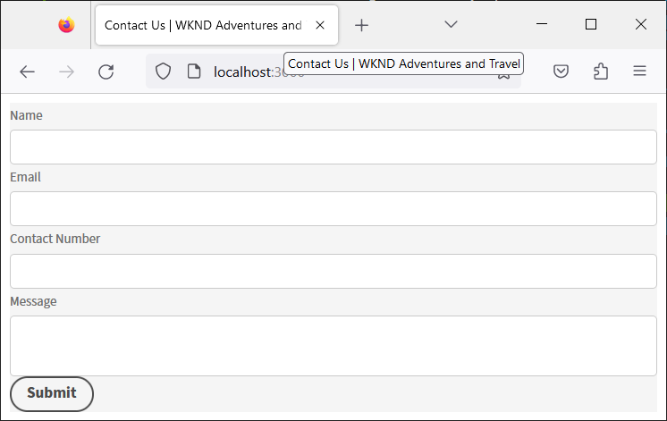

# 使用React應用程式建立和預覽Headless表單 {#introduction}

入門套件可協助您使用React應用程式快速入門。 您可以在自己選擇的Angular、Vanilla JS和其他開發環境中自由開發及使用Headless調適型表單。

從Headless最適化表單開始使用相當簡單快速。 複製現成的React專案、安裝相依性並執行專案。 您已將Headless最適化表單整合在React應用程式中並開始執行。 在部署至生產環境前，您可以使用範例react專案來建置及測試Headless調適型表單。

讓我們開始吧：

>[!NOTE]
>
>
> 本快速入門手冊使用React應用程式。 您可以自由使用所選的技術或程式語言來使用Headless最適化表單。

## 開始之前 {#pre-requisites}

若要建立並執行React應用程式，您的電腦上應已安裝下列專案：

* 安裝 [最新版本的Git](https://git-scm.com/downloads). 如果您是Git的新手，請參閱 [安裝Git](https://git-scm.com/book/en/v2/Getting-Started-Installing-Git).

* 安裝 [Node.js 16.13.0或更新版本](https://nodejs.org/en/download/). 如果您是初次使用Node.js，請參閱 [如何安裝Node.js](https://nodejs.dev/en/learn/how-to-install-nodejs).

## 立即開始

當您滿足需求後，請執行以下步驟以開始：

1. [設定Headless最適化表單入門套件](#setup)

1. [預覽入門套件中包含的Headless最適化表單](#preview)

1. [建立和演算您自己的Headless最適化表單](#custom)


## 1.設定Headless最適化表單入門套件 {#install}

入門套件是React應用程式，其中包含範例Headless最適化表單和對應的程式庫。 使用套件來開發和測試您的Headless調適型表單和對應的React元件。 執行以下命令以設定Headless最適化表單入門套件：

1. 開啟命令提示字元並執行下列命令：

   ```shell
   git clone https://github.com/adobe/react-starter-kit-aem-headless-forms
   ```

   該指令會建立一個名為 **react-starter-kit-aem-headless-forms** 將Headless適用性表單複製React入門應用程式至您目前的位置。 目錄以及呈現表單所需的設定和相依性清單，包括下列重要內容：

   * **範例表單**：入門套件包含範例貸款申請表。 若要檢視應用程式包含的表單（表單定義），請開啟 `/react-starter-kit-aem-headless-forms/form-definations/form-model.json` 檔案。
   * **react元件範例**：入門套件包括RTF和Slider的範例React元件。 本指南可協助您使用這些RTF和Slider元件建立自己的自訂元件。
   * **對映.ts**： mappings.ts檔案可協助您將自訂元件與表單欄位對應。 例如，將數值步進器欄位與評等元件對應。
   * **環境設定**：環境設定可讓您選擇轉譯入門套件中包含的表單，或從AEM Forms伺服器擷取表單。

   

   >[!NOTE]
   >
   > 
   > 檔案中的範例以VSCode為基礎。 您可以自由使用任何純文字程式碼編輯器。


1. 導覽至 **react-starter-kit-aem-headless-forms** 目錄並執行下列命令以安裝相依性：

   ```shell
   npm install
   ```

   命令會下載執行和建置應用程式所需的所有必要套件和程式庫，例如Headless適用性表單程式庫(@aemforms/af-react-renderer、@aemforms/af-react-components、@adobe/react-spectrum)、執行驗證，以及保留表單例項的資料。

   


## 2.預覽Headless最適化表單 {#preview}

設定入門套件後，您可以預覽範例Headless最適化表單，將其取代為您自己的自訂表單。 您也可以設定入門套件以從AEM Forms伺服器擷取表單。 預覽表單的方式

1. 重新命名 `env_template` 檔案到 `.env` 檔案。 同時請確定USE_LOCAL_JSON選項設為true。

   

   <!-- The options in the .env file help you configure source of the forms definantion (.JSON):
    *  To source forms definantion (.JSON) from an AEM Server, set USE_LOCAL_JSON option to false, use the AEM_URL option to specify URL  of your AEM Server, and set the AEM_FORM_PATH option to path of your adaptive form.
    *  To source forms definantion (.JSON) form-model.json file included in the starter-kit, set USE_LOCAL_JSON option to false. -->

1. 使用以下命令執行應用程式：

   ```shell
     npm start
   ```


   此命令會啟動本機開發伺服器，並在您的預設網頁瀏覽器中開啟範例Headless最適化表單（包含在入門應用程式中）。

   

   瞧！ 您已準備開始開發自訂Headless最適化表單。

   <!--  As you know, in a headless form the form data and logic are separate from the presentation layer and can be used by any client that can make HTTP requests, such as a mobile app, a static site, or a different web application. The form is often managed and stored on a server, which serves as the backend for the form. The client sends requests to the server to retrieve the form, submit data, and receive updated form data. This allows for greater flexibility and integration with different technologies. You can store and retrive a Headless adaptive form on an AEM Server  -->

## 3.建立並演算您自己的Headless最適化表單{#custom}

Headless最適化表單以JSON （JavaScript物件標籤法）格式表示表單及其元件，例如欄位和按鈕。 使用JSON格式的優點在於它可以被各種程式語言輕鬆剖析和使用，使其成為在系統之間交換表單資料的便利方式。 若要檢視應用程式隨附的Headless最適化表單範例，請開啟 `/react-starter-kit-aem-headless-forms/form-definations/form-model.json` 檔案。

讓我們建立包含四個欄位的連絡人表單：「姓名」、「電子郵件」、「聯絡電話」和「訊息」。 這些欄位被定義為JSON中的物件（專案），每個物件（專案）都具有型別、標籤、名稱和必填等屬性。 表單也有「提交」型別的按鈕。 以下是表單的JSON。


```JSON
{
  "afModelDefinition": {
    "adaptiveform": "0.10.0",
    "items": [
      {
        "fieldType": "text-input",
        "label": {
          "value": "Name"
        },
        "name": "name"
      },
      {
        "fieldType": "text-input",
        "format": "email",
        "label": {
          "value": "Email"
        },
        "name": "email"
      },
      {
        "fieldType": "text-input",
        "format": "phone",
        "pattern": "[0-9]{10}",
        "label": {
          "value": "Contact Number"
        },
        "name": "Phone"
      },
      {
        "fieldType": "multiline-input",
        "label": {
          "value":"Message"
        },
        "name": "message"
      },
      {
        "fieldType": "button",
        "label":{
          "value": "Submit"
        },
        "name":"submit",
        "events":{
          "click": "submitForm()"
        }
      }
    ],
    "action": "https://eozrmb1rwsmofct.m.pipedream.net",
    "description": "Contact Us",
    "title": "Contact Us",
    "metadata": {
      "grammar": "json-formula-1.0.0",
      "version": "1.0.0"
    }
  }
}
```

>[!NOTE]
>
> * 「afModelDefinition」屬性僅適用於React應用程式，不是表單定義的一部分。
> * 您可以手工製作表單JSON或使用 [AEM調適型表單編輯器（調適型表單WYSIWYG編輯器）](create-a-headless-adaptive-form.md) 以建立和傳遞表單JSON。 在生產環境中，您可以使用AEM Forms來傳送表單JSON，稍後將提供更多相關資訊。
> * 本教學課程使用https://pipedream.com/測試表單提交內容。 您使用自己的或組織核准的第三方端點，從Headless最適化表單接收資料。


若要轉譯表單，請取代範例Headless最適化表單JSON `/react-starter-kit-aem-headless-forms/form-definations/form-model.json` 使用上述JSON，儲存檔案，等待入門套件編譯並重新整理表單。


<!-- Your form is ready. Let's add some validations and make "Name", "Email", and "Message" fields mandatory. -->

您已成功轉譯Headless最適化表單。


## 額外的

讓我們將託管表單的網頁標題設為 `Contact Us | WKND Adventures and Travel`. 若要變更標題，請開啟 _react-starter-kit-aem-headless-forms/public/index.html_ 編輯和設定標題的檔案。




## 下一步

依預設，入門套件會使用 [Adobe光譜](https://spectrum.adobe.com/) 要呈現表單的元件。 您可以使用建立並使用您自己的元件或協力廠商元件。 例如，使用Google材料UI或Chakra UI。

讓我們 [使用Google素材UI](use-google-material-ui-react-components-to-render-a-headless-form.md) 以呈現「聯絡我們」表單。


