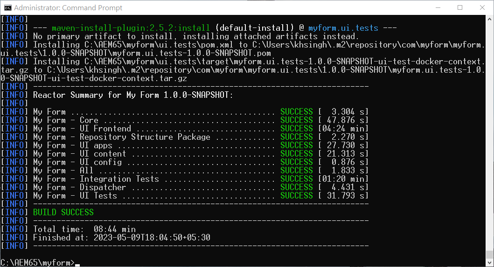

# 在AEM 6.5 Forms上啟用Headless最適化Forms {#enable-headless-adaptive-forms-on-aem-65-forms}

若要在您的AEM 6.5 Forms環境中啟用Headless最適化Forms，請設定AEM Archetype 41或更新版本的專案，並將其部署至您的所有製作和發佈執行個體。

將AEM Archetype 41或更新版本的專案部署到AEM 6.5 Forms執行個體後，您就可以 [建立以核心元件為基礎的最適化Forms](create-a-headless-adaptive-form.md). 這些表單以JSON格式表示，並當作Headful和Headless最適化Forms使用，以便在包括行動、網頁和原生應用程式在內的一系列管道中提供更大的彈性和自訂。

## 先決條件 {#prerequisites}

在AEM 6.5 Forms環境中啟用Headless最適化Forms之前，

* [升級至AEM 6.5 Forms Service Pack 16 (6.5.16.0)或更新版本](https://experienceleague.adobe.com/docs/experience-manager-65/release-notes/aem-forms-current-service-pack-installation-instructions.html).

* 安裝最新版本的 [Apache Maven](https://maven.apache.org/download.cgi).

* 安裝純文字編輯器。 例如，Microsoft Visual Studio Code。

## 建立及部署最新的AEM原型專案

若要建立AEM Archetype 41或 [稍後](https://github.com/adobe/aem-project-archetype) 根據專案並將其部署至所有作者和發佈執行個體：

1. 以管理員身分登入電腦，託管並執行AEM 6.5 Forms執行個體。
1. 開啟命令提示或終端機。
1. 執行以下命令，建立以AEM Archetype 41為基礎的專案：

   * Microsoft Windows

   ```Shell
      mvn -B org.apache.maven.plugins:maven-archetype-plugin:3.2.1:generate ^
      -D archetypeGroupId=com.adobe.aem ^
      -D archetypeArtifactId=aem-project-archetype ^
      -D archetypeVersion=41 ^
      -D appTitle="My Form" ^
      -D appId="myform" ^
      -D groupId="com.myform" ^
      -D includeFormsenrollment="y" ^
      -D aemVersion="6.5.15" 
   ```

   * Linux或Apple macOS

   ```Shell
      mvn -B org.apache.maven.plugins:maven-archetype-plugin:3.2.1:generate \
      -D archetypeGroupId=com.adobe.aem \
      -D archetypeArtifactId=aem-project-archetype \
      -D archetypeVersion=41 \
      -D appTitle="My Form" \
      -D appId="myform" \
      -D groupId="com.myform" \
      -D includeFormsenrollment="y" \
      -D aemVersion="6.5.15" 
   ```

   執行上述命令時，請務必考慮以下幾點：

   * 更新命令以反映環境的特定值，包括appTitle、appId和groupId。 此外，請將includeFormsenrollment的值設為「y」。 如果您使用Forms入口網站，請設定 _includeExamples=y_ 可在您的專案中包含Forms Portal核心元件的選項。

   * 請勿將&#39;aemVersion&#39;從6.5.15.0變更為其他任何版本。

1. （僅適用於以Archetype版本41為基礎的專案）在AEM Archetype專案建立後，請為以核心元件為基礎的最適化Forms啟用主題。 若要啟用主題：

   1. 開啟 [AEM原型專案資料夾]/ui.apps/src/main/content/jcr_root/apps/__appId__/components/adaptiveForm/page/customheaderlibs.html進行編輯：

   1. 在第21行新增下列程式碼：

      ```XML
      <sly data-sly-use.clientlib="core/wcm/components/commons/v1/templates/clientlib.html"
      data-sly-use.formstructparser="com.adobe.cq.forms.core.components.models.form.FormStructureParser"
      data-sly-test.themeClientLibRef="${formstructparser.themeClientLibRefFromFormContainer}">
      <sly data-sly-test="${themeClientLibRef}" data-sly-call="${clientlib.css @ categories=themeClientLibRef}"/>
      </sly>
      ```

      

   1. 儲存並關閉檔案。

1. 更新專案以包含最新版Forms核心元件：

   1. 開啟 [AEM原型專案資料夾]/pom.xml進行編輯。
   1. 設定版本 `core.forms.components.version` 和 `core.forms.components.af.version` 至 [最新Forms核心元件](https://github.com/adobe/aem-core-forms-components/tree/release/650) 版本。

      

   1. 儲存並關閉檔案。


1. 成功建立AEM原型專案後，為您的環境建置部署套件。 若要建置套件：

   1. 導覽至AEM Archetype專案的根目錄。


   1. 執行以下命令，為您的環境建置AEM原型專案：

      ```Shell
      mvn clean install
      ```

      


   成功建置AEM Archetype專案後，會產生AEM套件。 您可以在下列位置找到此套件： [AEM原型專案資料夾]\all\target\[appid].all-[版本].zip

1. 使用 [封裝管理員](https://experienceleague.adobe.com/docs/experience-manager-65/administering/contentmanagement/package-manager.html?lang=zh-Hant) 以部署 [AEM原型專案資料夾]\all\target\[appid].all-[版本].zip套件。

>[!NOTE]
>
>
>
>如果您在存取發佈執行個體的登入對話方塊以透過封裝管理員安裝套件時遇到困難，請嘗試透過以下URL登入： http://[發佈伺服器URL]：[連線埠]/system/console。 這可讓您登入發佈執行個體，讓您繼續安裝程式。


核心元件已針對您的環境啟用。 將空白的Core Components型最適化表單範本和畫布3.0主題部署到您的環境，讓您能夠 [建立以核心元件為基礎的最適化Forms](create-a-headless-adaptive-form.md).

## 常見問答

### 核心元件有哪些？

[核心元件](https://experienceleague.adobe.com/docs/experience-manager-core-components/using/introduction.html) 是一組適用於 AEM 的標準化網站內容管理 (WCM) 元件，可加快開發時間並降低網站的維護成本。

### 啟用核心元件時新增了哪些功能？


當為您的環境啟用調適型表單核心元件時，一個以核心元件為主的調適型表單空白範本和 Canvas 3.0 主題會新增至您的環境中。為您的環境啟用調適型表單核心元件後，您可以：

* 建立以核心元件為主的調適型表單。
* 建立以核心元件為主的調適型表單範本。
* 為以核心元件為主的調適型表單範本建立自訂主題。
* 將以核心元件為主的調適型表單的代表提供給一些管道，例如行動、網頁、本機應用程式和需要表單以 Headless 呈現的服務。。
