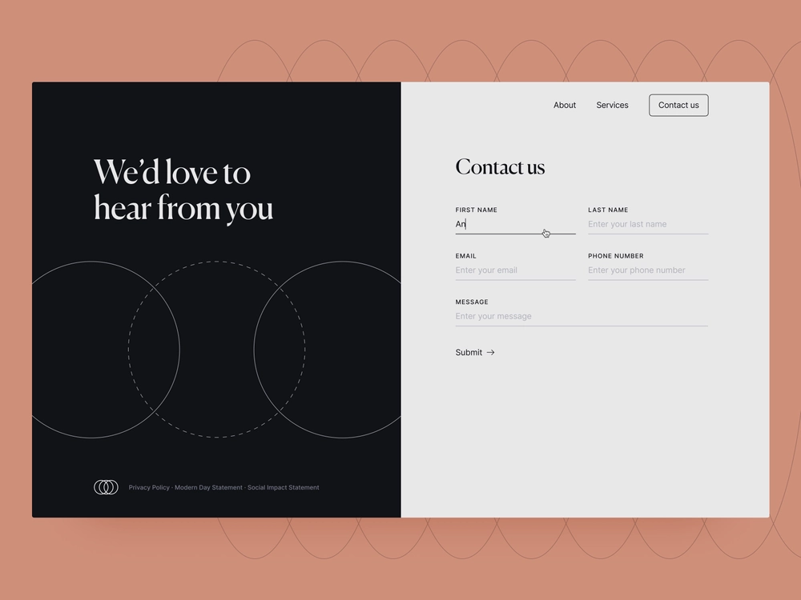

# Headless最適化Forms快速入門

本教學課程提供建立Headless最適化表單的端對端架構。 本教學課程可組織為一個使用案例和多個指南。 每本指南都可協助您學習並將新功能新增至本教學課程中建立的Headless最適化表單。 每本指南後，您都有可用的Headless最適化表單。 在本教學課程結束時，您將能夠：

* 建立Headless最適化表單
* 將商業規則新增至您的表單
* 使用Google素材UI設定表單樣式
* 預填您的表單 
* 將表單內嵌至網頁

您也將建置Headless適用性表單的架構、可用成品和JSON結構的瞭解。

**歷程從學習使用案例開始**：

Raya Tan是這個以自然美景和旅遊經濟蓬勃發展而聞名的國家的外交部成員，負責監督向遊客分發簽證表格。 這些表單可於部門網站、原生行動應用程式上取得，並以PDF格式提供，且有多個語言選項供遊客選擇。 不過，在不同平台和技術中管理和擴充這些表單可能相當困難。

為了提高簽證申請程式的效率和彈性，外交部決定採用Headless最適化表格方法。 這種分離式架構將前端與後端分開，允許更大的自訂與擴充性。 部門計畫使用Google原物料UI的React元件來增強表單的使用者體驗，同時利用後端功能，例如數位簽名、資料整合、業務流程管理、記錄檔案和使用情況分析。

遊客最常使用的表格是「聯絡我們」表格，用於詢問各種問題。 因此，外部部門已選擇開始使用此表單實施Headless調適型表單方法。 本教學課程將引導您使用此新架構建立「聯絡我們」表單。 最終結果將如下所示：

