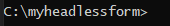
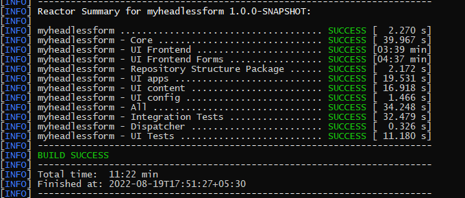
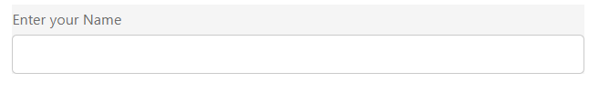
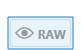
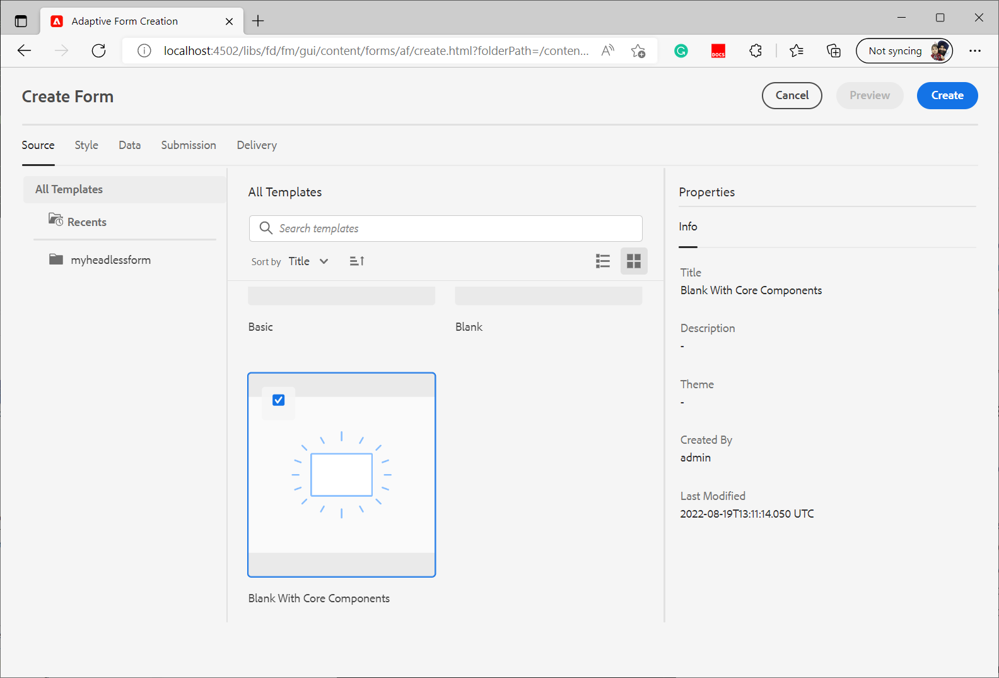

# 建立您的第一個Headless最適化表單

您可以使用Adobe Experience Manager Headless調適型表單來建立使用前端UI （例如React）的表單應用程式，並使用Forms Web SDK進行狀態管理、驗證及與各種其他接觸點整合等功能。

例如，We.Org組織想要將其客戶註冊歷程數位化。 他們的開發人員精通使用Angular來建置前端解決方案。 他們想要建立自訂前端，同時將表單驗證和電子簽章解除安裝到專業解決方案。

Adobe Experience Manager Headless調適型表單讓這類組織能夠自由使用其在前端語言中的現有專業知識來建立表單，同時支援使用後端功能來建立企業級表單體驗。

<!-- >>[!VIDEO](https://video.tv.adobe.com/v/341011/) -->

<!--   -->

## 開始之前

* 設定 [開發環境](setup-development-environment.md) 讓您在本機電腦上建立和測試Headless最適化表單。
* 下列軟體必須安裝在您的本機開發電腦上：
   * [Java Development Kit 11](https://experience.adobe.com/#/downloads/content/software-distribution/en/general.html?1_group.propertyvalues.property=.%2Fjcr%3Acontent%2Fmetadata%2Fdc%3AsoftwareType&amp;1_group.propertyvalues.operation=equals&amp;1_group.propertyvalues.0_values=software-type%3Atooling&amp;fulltext=Oracle%7E+JDK%7E+11%7E&amp;orderby=%40jcr%3Acontent%2Fjcr%3AlastModified&amp;orderby.sort=desc&amp;layout=list&amp;p=list&amp;p.offset=limit&amp;p.offset=0&amp;p.limit=14444)
   * [最新版本的Git](https://git-scm.com/downloads). 如果您是Git的新手，請參閱 [安裝Git](https://git-scm.com/book/en/v2/Getting-Started-Installing-Git).
   * [Node.js 16.13.0或更新版本](https://nodejs.org/en/download/). 如果您是初次使用Node.js，請參閱 [如何安裝Node.js](https://nodejs.dev/en/learn/how-to-install-nodejs).
   * [Maven 3.6或更新版本](https://maven.apache.org/download.cgi). 如果您是Maven的新手，請參閱 [安裝Apache Maven](https://maven.apache.org/install.html).


## 使用原型專案建立Headless最適化表單

原型專案是以Maven為基礎的範本。 它會根據最佳實務來建立最低限度的專案，以開始使用Headless調適型表單。 此外也包含適用於Formsas a Cloud Service和本機開發環境的Headless適用性表單功能。 在Beta版階段期間，必須建立和部署原型37或以上版本的專案。 測試版之後只需有專案進行自訂。

執行以下步驟來建立和轉譯您的第一個Headless最適化表單：

1. [建立及部署AEM原型專案](#create-an-archetype-based-project)
1. [將專案部署至AEM SDK](#deploy-the-project-to-a-local-development-environment)
1. [建立Headless最適化表單的JSON結構描述，並將其上傳到您的AEM SDK執行個體](#create-add-json-representation-of-headless-adaptive-forms)
1. [根據帶有核心元件的空白範本建立最適化表單](#create-adaptive-form-with-blank-with-core-components-template)


### 1.建立及部署以AEM原型為基礎的專案 {#create-an-archetype-based-project}

根據作業系統，執行以下命令以建立Experience Manager Formsas a Cloud Service專案。 使用原型版本37或更新版本。 請參閱， [原型檔案](https://experienceleague.adobe.com/docs/experience-manager-core-components/using/developing/archetype/overview.html) 以尋找最新版的Archetype。

**Microsoft Windows**

1. 以系統管理員許可權開啟命令提示字元（以系統管理員身分執行命令提示字元或bash shell）
1. 執行以下命令：

   ```shell
     mvn -B org.apache.maven.plugins:maven-archetype-plugin:3.2.1:generate ^
     -D archetypeGroupId=com.adobe.aem ^
     -D archetypeArtifactId=aem-project-archetype ^
     -D archetypeVersion=37 ^
     -D appTitle=myheadlessform ^
     -D appId=myheadlessform ^
     -D groupId=com.myheadlessform ^
     -D includeFormsenrollment="y" ^
     -D includeFormsheadless="y" 
   ```

   * 設定 `appTitle` 以定義標題和元件群組。
   * 設定 `appId` 以定義Maven artifactId、元件、設定和內容資料夾名稱以及使用者端資料庫名稱。
   * 設定 `groupId` 以定義Maven groupId和Java來源套件。
   * 使用 `includeFormsenrollment=y` 此選項可包含建立最適化Forms所需的Forms特定設定、主題、範本、核心元件和相依性。
   * 使用 `includeFormsheadless=y` 包含Forms核心元件的選項，以及包含Headless最適化Forms功能所需的相依性。 啟用此選項時，會包含下列專案：
      * 此 **核心元件空白** 範本與 [核心元件](https://experienceleague.adobe.com/docs/experience-manager-core-components/using/introduction.html?lang=zh-Hant).
      * 前端React模組， `ui.frontend.react.forms.af`. 它可協助您在react應用程式中轉譯Headless最適化表單。


**Apple macOS或Linux**：

1. 以root使用者的身分開啟終端機。 它可讓您以管理許可權執行命令。 您也可以使用 `sudo root` 命令執行之前，開啟終端機視窗以使用系統管理許可權執行命令。
1. 執行以下命令：

   ```shell
     mvn -B org.apache.maven.plugins:maven-archetype-plugin:3.2.1:generate \
     -D archetypeGroupId=com.adobe.aem \
     -D archetypeArtifactId=aem-project-archetype \
     -D archetypeVersion=37 \
     -D appTitle=myheadlessform \
     -D appId=myheadlessform \
     -D groupId=com.myheadlessform \
     -D includeFormsenrollment="y" \
     -D includeFormsheadless="y"  
   ```

   * 設定 `appTitle` 以定義標題和元件群組。
   * 設定 `appId` 以定義Maven artifactId、元件、設定、內容資料夾名稱和使用者端資料庫名稱。
   * 設定 `groupId` 以定義Maven groupId和Java來源套件。
   * 使用 `includeFormsenrollment=y` 此選項可包含建立最適化Forms所需的Forms特定設定、主題、範本、核心元件和相依性。
   * 使用 `includeFormsheadless=y` 包含Forms核心元件的選項，以及包含Headless最適化Forms功能所需的相依性。 啟用此選項時，會包含下列專案：
      * 此 **核心元件空白** 範本與 [核心元件](https://experienceleague.adobe.com/docs/experience-manager-core-components/using/introduction.html?lang=zh-Hant).
      * 前端反應模組， `ui.frontend.react.forms.af`. 它可協助您在react應用程式中轉譯Headless最適化表單。

成功完成命令後，將專案資料夾命名為 `appID` 「 」已建立。 例如，如果您使用 `appID` 含值 `myheadlessform`，資料夾： `myheadlessform` 「 」已建立。 它包含以原型為基礎的專案。


### 2.將專案部署至AEM SDK {#deploy-the-project-to-a-local-development-environment}

將專案部署至AEM SDK執行個體時，它會新增Headless最適化Forms功能、 **核心元件空白** 範本以及專案中包含的其他資源複製到您的開發環境。 <!-- Deploy the project to your local development environment to locally create Headless Adaptive Forms. or deploy directly to your Forms as a Cloud Service environment. !--> 若要部署至您的AEM SDK執行個體：

1. 開啟命令提示。 如果您在Windows上，請以[管理]許可權開啟命令提示字元([執行]命令提示字元或 [Git bash shell](https://khushwantsehgal.wordpress.com/2022/06/29/check-if-git-bash-is-running-in-administrator-mode/)  （身為管理員）。

1. 導覽至上一步建立的專案目錄。 例如 `/myheadlessform`

   

1. 執行以下命令：

   ```shell
   mvn -PautoInstallPackage clean install
   ```

   等待「建置成功」訊息。
   

   解決相依性並部署專案可能需要很長時間。 如果部署專案失敗，請參閱 [疑難排解](troubleshooting.md) 常見問題及其解決方案的文章。


<!-- *  To learn how to deploy code to AEM as a Cloud Service, see the video in [Deploying to AEM as a Cloud Service]https://experienceleague.adobe.com/docs/experience-manager-cloud-service/content/implementing/deploying/overview.html?lang=en#coding-against-the-right-aem-version) article : -->


### 3.建立Headless最適化表單的JSON結構描述，並將其上傳至您的AEM SDK執行個體 {#create-add-json-representation-of-headless-adaptive-forms}

Headless最適化Forms會以JSON檔案表示。 範例表單可從以下網址取得： [Storybook](https://opensource.adobe.com/aem-forms-af-runtime/storybook/?path=/story/reference-examples--contact) 或在以下位置使用原型專案中的範例表單包含 `[Archetype Project]\ui.content\src\main\content\jcr_root\content\dam\myheadlessform\af_model_sample.json`. 本檔案使用 [簡介](https://opensource.adobe.com/aem-forms-af-runtime/storybook/?path=/story/reference-examples--introduction) 表單。 它是單一欄位表單，可幫助您快速開始使用Headless最適化Forms。 <!-- The [specifications](/help/assets/Headless-Adaptive-Form-Specification.pdf) document provides detailed information about various components, rules, and constraints for Headless Adaptive Forms -->

若要建立並上傳結構：

1. 建立副檔名為的純文字檔案 `.json`. 例如 `myfirstform.json`。您可以在檔案系統上的任何位置或在基於AEM Archetype的專案中建立檔案，位置為 `\<project-name>\ui.content\src\main\content\jcr_root\content\dam\myheadlessform\<formname>.json`
1. 將下列JSON內容新增至 `.json` 檔案並儲存：

   ```JSON
   {
     "adaptiveform": "0.10.0",
     "items": [
       {
         "fieldType": "text-input",
         "label": {
           "value": "Enter your Name"
         },
         "name": "textInput"
       }
     ],
     "metadata": {
       "grammar": "json-formula-1.0.0",
       "version": "1.0.0"
     }
   }
   ```

   它會新增單一欄位至表單：

   

1. 登入您的 [本機AEM SDK執行個體](setup-development-environment.md#setup-author-instance)
1. 導覽至「Adobe Experience Manager > Forms > Forms和檔案」。 點選「建立>檔案上傳」。
1. 選取 `.json` 在步驟2建立並上傳它。 您已準備好建立Headless最適化表單。 如果您將.json檔案儲存在AEM原型專案，位於 `\<project-name>\ui.content\src\main\content\jcr_root\content\dam\myheadlessform\<formname>.json`. 您可以使用 `mvn -PautoInstallPackage clean install` 將專案部署至您的AEM SDK，並 `<formname>.json` 以及它。

如果上傳失敗 `.json`，確認 [AEM原型專案已成功部署](#deploy-the-project-to-a-local-development-environment).

<!-- 1. Open the [contact form](https://opensource.adobe.com/aem-forms-af-runtime/storybook/?path=/story/reference-examples--contact) and tap the [](faq.md#storybook-example) icon on bottom-right side of the Storybook page to view the source code of the headless . 

You can use [Adaptive Forms builder extension for Visual Studio Code](/help/setup-development-environment.md#microsot-visual-studio-code-extension-for-headless-adaptive-forms) to build a JSON schema of your Headless Adaptive Forms. 

You can see [Storybook](https://opensource.adobe.com/aem-forms-af-runtime/storybook/?path=/story/reference-examples--introduction) for sample JSON schemas and list of components, attributes, and properties. You can also see the [specifications document](/help/assets/Headless-Adaptive-Form-Specification.pdf) for detailed information on all the components, constraints, and methods available to define Headless Adaptive Forms.

File extension of a JSON schema of Headless Adaptive Forms is .json. For example, formname.json. Create or add the file to your AEM Archetype based project. For example, `\myheadlessform\ui.content\src\main\content\jcr_root\content\dam\myheadlessform\home-loan.json` -> 

### 3. Deploy the project to a local development environment {#deploy-the-project-to-a-local-development-environment}

You can deploy the project to local development environment. It adds Headless Adaptive Forms functionality, the **Blank with core components** template, JSON schema of form, and other resources included in the project to your development environment. <!-- Deploy the project to your local development environment to locally create Headless Adaptive Forms. or deploy directly to your Forms as a Cloud Service environment. To deploy to your local development environment, use the following command: 

    `mvn -PautoInstallPackage clean install`

If you are on Windows, run the above with Administrative privileges (Run command prompt or [bash shell as an administrator](https://khushwantsehgal.wordpress.com/2022/06/29/check-if-git-bash-is-running-in-administrator-mode/)). For the complete list of commands, see [Building and Installing](https://experienceleague.adobe.com/docs/experience-manager-core-components/using/developing/archetype/using.html?lang=en#building-and-installing).
    
<!-- *  To learn how to deploy code to AEM as a Cloud Service, see the video in [Deploying to AEM as a Cloud Service]https://experienceleague.adobe.com/docs/experience-manager-cloud-service/content/implementing/deploying/overview.html?lang=en#coding-against-the-right-aem-version) article : -->

### 4.根據帶有核心元件的空白範本建立最適化表單 {#create-adaptive-form-with-blank-with-core-components-template}

1. 登入您的 [AEM SDK執行個體](http://localhost:4502/).

1. 導覽至「Adobe Experience Manager > Forms > Forms和檔案」。

1. 點選「建立」並選取「最適化表單」。 選取 **核心元件空白** 範本，然後點選「建立」。

   

1. 指定下列屬性欄位的值。 「標題」和「名稱」欄位為必填欄位：

   * **標題**：指定表單的顯示名稱。 標題可協助您在Experience Manager Forms使用者介面中識別表單。
   * **名稱**：指定表單的名稱。 存放庫中會建立具有指定名稱的節點。您開始輸入標題時，就會自動產生名稱欄位的值。您可以變更建議的值。名稱欄位只能包含字母數字字元、連字號和底線。所有無效的輸入都會以連字號取代。

1. 點選「建立」。已建立最適化表單。

如果您沒有看到 **核心元件空白** 範本，確認 [AEM原型專案已成功部署](#deploy-the-project-to-a-local-development-environment).

### 5.設定最適化表單以使用JSON結構描述 {#configure-adaptive-form-to-use-the-JSON-representation}

上一步建立的最適化表單是空白的。 設定最適化表單以使用JSON結構描述：

1. 登入您的 [AEM SDK執行個體](http://localhost:4502/).

1. 導覽至「Adobe Experience Manager > Forms > Forms和檔案」。 選取在上一步建立的最適化表單，然後點選「編輯」。 最適化表單會在編輯器中開啟。

1. 點選「最適化Forms容器」元件，然後點選「屬性」。 它會在側欄中顯示屬性總管。

1. 在屬性檔案總管中，展開「基本」設定追蹤器，並為「Forms執行階段檔案路徑」選項指定上一步驟中所上傳之JSON結構描述的路徑。 容器元件會顯示表單的轉譯。

1. 在屬性總管中，展開「提交」摺疊式功能表，並設定最適化表單的「提交動作」 。 您的表單已準備好用於react應用程式。

1. 若要轉譯表單（在您本機開發電腦上託管）：

   1. 開啟 `[Archetype project]\ui.frontend.react.forms.af\.env` 並設定表單路徑。 例如，/content/forms/af/contact

   1. 開啟命令提示字元並導覽至ui.frontend.react.forms.af專案，然後執行下列命令：

      `npm run start`

   1. 完成後，在瀏覽器視窗中開啟localhost：3000 ，以檢視已轉譯的Headless最適化表單。
   1. 若要測試提交功能，請登入AEM Forms伺服器，並使用 **以HTML預覽表單** 在預覽模式中開啟表單的選項。

此 [Storybook](https://opensource.adobe.com/aem-forms-af-runtime/storybook/) 提供可在各種Headless最適化Forms上設定的元件和規則清單，以及Headless最適化Forms的JSON結構描述的一些範例。 您也可以檢視 [規格](/help/assets/Headless-Adaptive-Form-Specification.pdf) 瞭解與Headless最適化Forms相關的各種規則和屬性的檔案。
