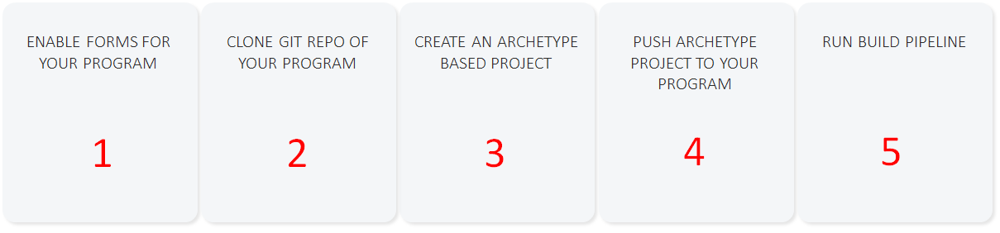
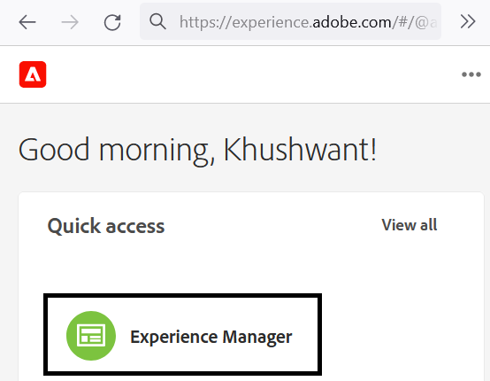
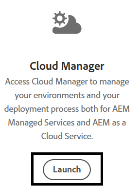
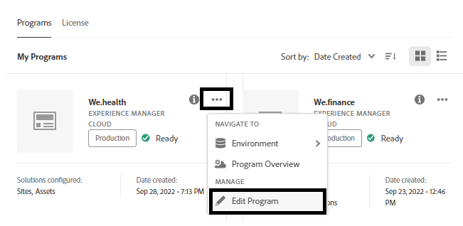
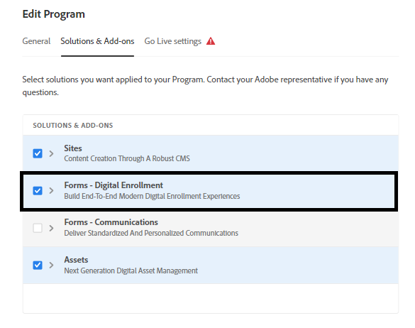
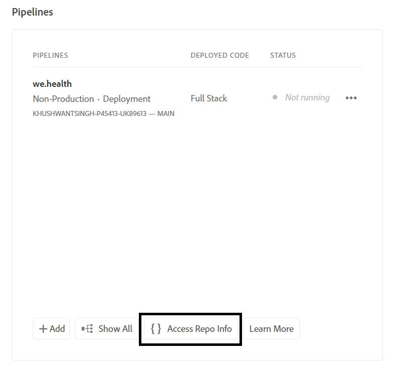
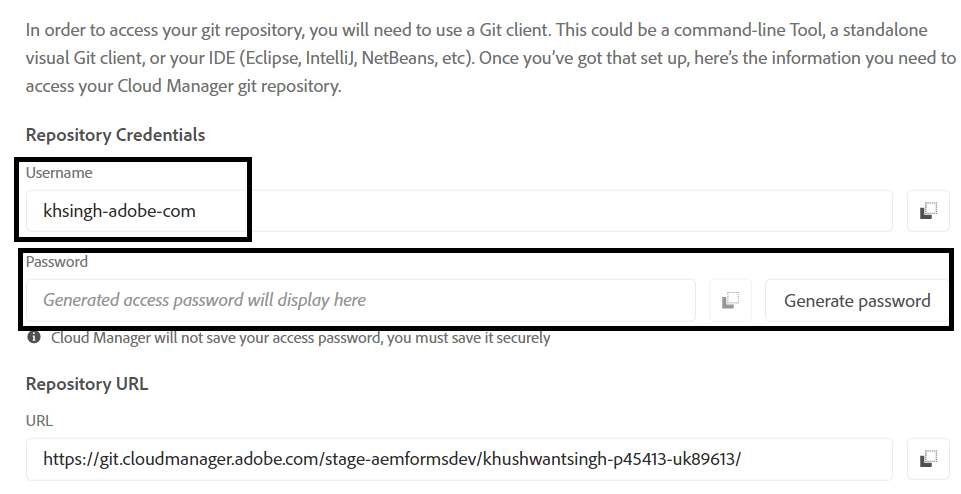
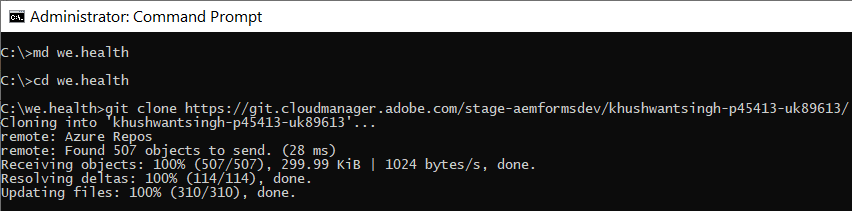
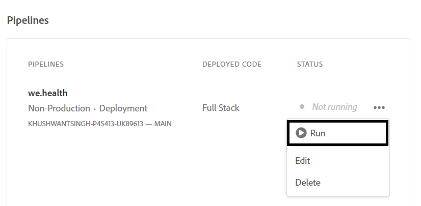

# 設定Cloud Service上Headless最適化表單的開發環境

<span class="preview"> 這是 **工作進行中** 文章。</span>


準備好在Cloud Service上建置和測試Headless最適化表單了嗎？ 為您的Cloud Service方案啟用Forms並開始。

## 開始之前

* 安裝 [最新版本的Git](https://git-scm.com/downloads) 本機電腦上。 如果您是Git的新手，請參閱 [安裝Git](https://git-scm.com/book/en/v2/Getting-Started-Installing-Git). 您可以使用Git存放庫將在本機開發環境中開發的表單和自訂程式碼推送到Cloud Service開發環境。

* 安裝 [Node.js 16.13.0或更新版本](https://nodejs.org/en/download/) 本機電腦上。 如果您是初次使用Node.js，請參閱 [如何安裝Node.js](https://nodejs.dev/en/learn/how-to-install-nodejs).

* 建立AEMas a Cloud Service程式：依照以下步驟的1-7執行： [建立計畫](https://experienceleague.adobe.com/docs/experience-manager-cloud-service/content/onboarding/demo-add-on/create-program.html?#create-program) 文章，可為貴組織建立方案。

* 啟用 [您的Cloud Service計畫的發行前管道](https://experienceleague.adobe.com/docs/experience-manager-cloud-service/content/release-notes/prerelease.html?cloud-environments).

## 設定工作流程

若要在Formsas a Cloud Service沙箱上啟用Headless調適型表單，請啟用 `Forms - Digital enrolment` 您的AEM Cloud Service方案解決方案，在本機電腦上建立Archetype 37或更新版本的專案，並將其推送到您的Formsas a Cloud Service環境。 完整的程式為：



### 1.為您的程式啟用Forms

<table style="table-layout:auto">
<tr>
  <td>
  1.登入 <a href="https://experience.adobe.com/" > https://experience.adobe.com/ </a>  並選取 <b> Experience Manager </b> 選項。
  </td>
  <td>
    <a href="https://experienceleague.adobe.com/docs/experience-manager-cloud-service/content/onboarding/demo-add-on/create-program.html?#create-program">
      
    </a>
    <br>
  </td>
</tr>
<tr>
  <td>
  2.針對 <b> Cloud Manager </b> 選項，按一下 <b> Launch。 </b> 隨即顯示貴組織的計劃清單。
  </td>
  <td>
    <a href="https://experienceleague.adobe.com/docs/experience-manager-cloud-service/content/onboarding/demo-add-on/create-program.html?#create-program">
      
    </a>
    <br>
  </td>
</tr>
<tr>
  <td>
    3.針對您的程式，點選……圖示，然後選取 <b> 編輯計畫 </b> 選項。 對話方塊隨即顯示。 
  </td>
  <td>
    <a href="https://experienceleague.adobe.com/docs/experience-manager-cloud-service/content/onboarding/demo-add-on/create-program.html?#create-program">
      
    </a>
    <br>
  </td>
</tr>
<tr>
  <td>
    4.在「編輯程式」對話方塊中，移至 <b> 解決方案和附加元件索引標籤 </b>，選取 <b> Forms — 數位註冊 </b> 選項，然後點選 <b> 更新 </b>. 
  </td>
  <td>
    <a href="https://experienceleague.adobe.com/docs/experience-manager-cloud-service/content/onboarding/demo-add-on/create-program.html?#create-program">
      
    </a>
    <br>
  </td>
</tr>
</table>

### 2.將程式的Git存放庫複製到本機電腦

每個AEMas a Cloud Service程式都有一個Git存放庫。 它可讓您將自訂程式碼和資產從本機電腦上傳到您的Cloud Service環境。 在設定期間，我們使用Git存放庫將Headless最適化表單的相關程式碼、範本和其他資訊從本機電腦帶入Cloud Service程式。 在本機電腦上複製Cloud ServiceGit存放庫是將自訂程式碼和內容從本機電腦帶到Cloud Service的第一步。

>[!INFO]
>
> 您一律可以認可至Git存放庫，不必加以複製。 但是，它有它自己的怪癖。 因此，在本檔案中，我們使用複製方法。


複製存放庫：

<table style="table-layout:fixed">
<tr>
  <td>
  1.在您的程式的管道方塊中，點選 <b> 存取存放庫資訊。 </b> 會出現一個包含存放庫資訊的對話方塊 
  </td>
  <td>
    <a href="https://experienceleague.adobe.com/docs/experience-manager-cloud-service/content/onboarding/demo-add-on/create-program.html?#create-program">
      
    </a>
    <br>
  </td>
</tr>
<tr>
  <td>
  2.點選 <b> 產生密碼 </b> 並複製 <b> 存放庫URL。 </b> 
  </td>
  <td>
      
    <br>
  </td>
</tr>
<tr>
  <td>
    3.在本機電腦上，開啟命令提示字元、建立資料夾，然後執行下列命令，並提供存放庫認證（已要求）：
    </br>
    <code> git clone [Repository URL] </code> </br></br>
    例如， </br> 
    <code> git clone https://git.cloudmanager.adobe.com/stage-aemformsdev/khushwantsingh-p45413-uk89613/ </code>

</br> 被詢問時，取得 <b> 使用者名稱</b> 和 <b>密碼</b> 從 <b>存放庫資訊</b> 畫面。
</td>
  <td>
     
  </td>
</tr>
</table>


### 3.建立以AEM原型為主的專案

原型專案是以Maven為基礎的範本。 它會根據最佳實務來建立最低限度的專案，以開始使用Headless調適型表單。 此外也包含適用於Formsas a Cloud Service的核心Headless調適型表單功能。 必須建立和部署原型37或更新版本的專案。
®®？視作業系統而定，執行maven命令以建立Experience Manager Formsas a Cloud Service專案。 使用原型版本37或更新版本。 另請參閱 [原型檔案](https://experienceleague.adobe.com/docs/experience-manager-core-components/using/developing/archetype/overview.html) 以尋找最新版的Archetype。

+++ Microsoft® Windows

1. 以系統管理員許可權開啟命令提示字元（以系統管理員身分執行命令提示字元或bash shell）。
1. 執行以下命令：

   ```shell
     mvn -B org.apache.maven.plugins:maven-archetype-plugin:3.2.1:generate ^
     -D archetypeGroupId=com.adobe.aem ^
     -D archetypeArtifactId=aem-project-archetype ^
     -D archetypeVersion=37 ^
     -D appTitle=myheadlessform ^
     -D appId=myheadlessform ^
     -D groupId=com.myheadlessform ^
     -D includeFormsenrollment="y" ^
     -D includeFormsheadless="y" 
   ```

™™™ *設定 `appTitle` 以定義標題和元件群組。
*設定 `appId` 以定義Maven artifactId、元件、設定和內容資料夾名稱以及使用者端資料庫名稱。
*設定 `groupId` 以定義Maven groupId和Java™來源套件。
*使用 `includeFormsenrollment=y` 此選項可包含建立最適化Forms所需的Forms特定設定、主題、範本、核心元件和相依性。
*使用 `includeFormsheadless=y` 包含Forms核心元件的選項，以及包含Headless調適型表單功能所需的相依性。 啟用此選項時，會包含下列專案：\
* **核心元件空白** 範本與 [核心元件](https://experienceleague.adobe.com/docs/experience-manager-core-components/using/introduction.html?lang=zh-Hant).
*前端React模組， `ui.frontend.react.forms.af`. 它可協助您在react應用程式中轉譯Headless最適化表單。

+++®®？


+++ Apple macOS或Linux®

1. 以root使用者的身分開啟終端機。 它可讓您以管理許可權執行命令。 您也可以使用 `sudo root` 命令執行之前，開啟終端機視窗以使用系統管理許可權執行命令。
1. 執行以下命令：

   ```shell
     mvn -B org.apache.maven.plugins:maven-archetype-plugin:3.2.1:generate \
     -D archetypeGroupId=com.adobe.aem \
     -D archetypeArtifactId=aem-project-archetype \
     -D archetypeVersion=37 \
     -D appTitle=myheadlessform \
     -D appId=myheadlessform \
     -D groupId=com.myheadlessform \
     -D includeFormsenrollment="y" \
     -D includeFormsheadless="y"  
   ```

™™™ *設定 `appTitle` 以定義標題和元件群組。
*設定 `appId` 以定義Maven artifactId、元件、設定、內容資料夾名稱和使用者端資料庫名稱。
*設定 `groupId` 以定義Maven groupId和Java™來源套件。
*使用 `includeFormsenrollment=y` 此選項可包含建立最適化Forms所需的Forms特定設定、主題、範本、核心元件和相依性。
*使用 `includeFormsheadless=y` 包含Forms核心元件的選項，以及包含Headless調適型表單功能所需的相依性。 啟用此選項時，會包含下列專案：\
* **核心元件空白** 範本與 [核心元件](https://experienceleague.adobe.com/docs/experience-manager-core-components/using/introduction.html?lang=zh-Hant).
*前端反應模組， `ui.frontend.react.forms.af`. 它可協助您在react應用程式中轉譯Headless最適化表單。

+++

成功完成命令後，將專案資料夾命名為 `appID` 「 」已建立。 例如，如果您使用 `appID` 含值 `myheadlessform`，資料夾： `myheadlessform` 「 」已建立。 它包含以原型為基礎的專案。

### 4.將AEM原型專案推送至您的Cloud Service環境

1. 將Git存放庫的內容取代為Archtype型專案上的內容。

   >[!VIDEO](https://video.tv.adobe.com/v/3409809/)

1. 開啟命令提示字元，導覽至您的Git存放庫資料夾，然後依所列順序執行下列命令，將取代的內容上傳至您的Cloud Service環境。 您也可以使用視覺化編輯器，而不使用下列命令將內容推送至Cloud Service存放庫。

   ```
      git add .
      git commit
      git push origin
   ```

### 5.為您的程式執行建置管道


<table style="table-layout:auto">
<tr>
  <td>
  1.登入 <a href="https://experience.adobe.com/" > https://experience.adobe.com/ </a>  並選取 <b> Experience Manager </b> 選項。
  </td>
  <td>
    <a href="https://experienceleague.adobe.com/docs/experience-manager-cloud-service/content/onboarding/demo-add-on/create-program.html?#create-program">
      
    </a>
    <br>
  </td>
</tr>
<tr>
  <td>
  2.針對 <b> Cloud Manager </b> 選項，按一下 <b> Launch。 </b> 隨即顯示貴組織的計劃清單。 開啟您的程式。 
  </td>
  <td>
    <a href="https://experienceleague.adobe.com/docs/experience-manager-cloud-service/content/onboarding/demo-add-on/create-program.html?#create-program">
      
    </a>
    <br>
  </td>
</tr>
<tr>
  <td>
    3.針對您的管道，點選「 ... 」圖示，然後選取 <b> 執行 </b> 選項。 如果提示執行管道，請點選 <b> 執行 </b> 並等待管道 <b> 狀態 </b>  變更為 <b> 已完成 </b>.  
  </td>
  <td>
    <a href="https://experienceleague.adobe.com/docs/experience-manager-cloud-service/content/onboarding/demo-add-on/create-program.html?#create-program">
      
    </a>
    <br>
  </td>
</tr>
</table>

現在，您的環境已準備好使用Headless最適化表單。 您現在可以將表單的JSON定義上傳到您的Cloud Service環境，根據它建立Headless調適型表單，並使用 [getForm](https://opensource.adobe.com/aem-forms-af-runtime/api/#tag/Get-Form-Definition/operation/getForm) 和其他rest API，以便在您的應用程式或服務中使用Headless最適化表單。
