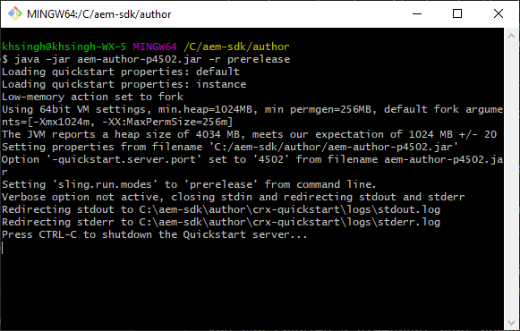

# 設定本機開發環境 {#headless-adaptive-forms-setup-development-environment}

您可以設定本機開發環境，以在本機電腦上建立和測試Headless最適化表單。 開發環境包含AEM SDK和安裝在AEM SDK上的AEM Forms功能封存。
<!--
 After a Headless adaptive form or related assets are ready on the local development environment, you can deploy the Headless adaptive form application to your publishing environment. -- >

You require knowledge to build application using react, Git, and Maven to use Headless adaptive forms.

<!-- 

### Download the latest version of AEM as a Cloud Service SDK or Forms feature archive (AEM Forms add-on) from Software Distribution {#software-distribution}

To download the supported version of Adobe Experience Manager as a Cloud Service SDK or Forms feature archive (AEM Forms add-on):

1. Log in to [Software Distribution](https://experience.adobe.com/#/downloads) portal with your Adobe ID.

    >[!NOTE]
    >
    > Your Adobe Organization must be provisioned for AEM as a Cloud Service to download the AEM as a Cloud Service SDK.

1. Navigate to the **[!UICONTROL AEM as a Cloud Service]** tab.
1. Sort by published date in descending order.
1. Click on the latest Adobe Experience Manager as a Cloud Service SDK or Forms feature archive (AEM Forms add-on).
1. Review and accept the EULA. Tap the **[!UICONTROL Download]** button. -->

## 系統需求 {#headless-adaptive-forms-system-requirements}

若要安裝AEM SDK，您的本機電腦必須符合下列最低需求：

* [Java Development Kit 11](https://experience.adobe.com/#/downloads/content/software-distribution/en/general.html?1_group.propertyvalues.property=.%2Fjcr%3Acontent%2Fmetadata%2Fdc%3AsoftwareType&amp;1_group.propertyvalues.operation=equals&amp;1_group.propertyvalues.0_values=software-type%3Atooling&amp;fulltext=Oracle%7E+JDK%7E+11%7E&amp;orderby=%40jcr%3Acontent%2Fjcr%3AlastModified&amp;orderby.sort=desc&amp;layout=list&amp;p=list&amp;p.offset=limit&amp;p.offset=0&amp;p.limit=14444)
* [最新版本的Git](https://git-scm.com/downloads). 如果您是Git的新手，請參閱 [安裝Git](https://git-scm.com/book/en/v2/Getting-Started-Installing-Git).
* [Node.js 16.13.0或更新版本](https://nodejs.org/en/download/). 如果您是初次使用Node.js，請參閱 [如何安裝Node.js](https://nodejs.dev/en/learn/how-to-install-nodejs).
* [Maven 3.6或更新版本](https://maven.apache.org/download.cgi). 如果您是Maven的新手，請參閱 [安裝Apache Maven](https://maven.apache.org/install.html).

## 設定開發環境 {#headless-adaptive-forms-procedure-to-setup-development-environment}

若要設定新的本機開發環境，並使用它來開發和測試Headless調適型表單：

1. [設定AEMas a Cloud ServiceSDK](#setup-author-instance).
1. [將AEM Forms封存(AEM FormsCloud Service附加元件)新增至AEM SDK](#add-forms-archive).

<!--

1. (Optional) [Add Forms-specific users to your local Author instance](#configure-users-and-permissions).
1. (Optional) Install [Adaptive forms builder extension for Microsoft Visual Studio Code](#microsoft-visual-studio-code-extension-for-headless-adaptive-forms). 

-->

### 1.設定AEMas a Cloud ServiceSDK {#setup-author-instance}

AEMas a Cloud ServiceSDK (AEM SDK)為開發人員提供本機體驗，以便建立和測試Headless最適化表單。 您可以使用AEMas a Cloud ServiceSDK來建立和預覽Headless最適化表單，好讓您在本機執行與開發相關的大多數驗證。 若要設定本機編寫執行個體：

1. [下載](https://experience.adobe.com/#/downloads/content/software-distribution/en/aemcloud.html) 最新 [!DNL Adobe Experience Manager] as a Cloud ServiceSDK。 使用發佈日期欄來排序並輕鬆找出最新的SDK。
其格式為.zip。 支援的版本為aem-sdk-2022.7.8085.20220725T140323Z-220700.zip和更新版本。

   


1. 將下載的.zip檔案解壓縮至本機電腦上的目錄。
1. 在本機電腦上建立目錄，作為編寫執行個體的安裝位置。 例如，`~/aem-sdk/author`。
1. 將解壓縮的SDK檔案中的.jar檔案複製到安裝位置，並將檔案重新命名為 `aem-author-p4502.jar`. 此 `p4502` 檔案名稱中的字串指定要使用的連線埠號碼。 您也可以指定不同的連線埠號碼。

   >[!NOTE]
   >
   > 請勿連按兩下.jar檔案以啟動它。 這會導致 [錯誤](https://experienceleague.adobe.com/docs/experience-manager-learn/cloud-service/local-development-environment-set-up/aem-runtime.html?lang=en#troubleshooting-double-click).

1. 開啟命令提示字元：
   * 在Windows上，使用 **以管理員身分執行** 在提升許可權模式中開啟命令提示字元的選項。
   * 在Linux上，請確定您以root使用者的身分開啟終端機視窗。

1. 導覽至包含複製的.jar檔案的安裝位置，然後執行下列命令：

   `java -jar aem-author-p4502.jar -r prerelease`

   

   * 此 `-r prerelease` switch只會啟用發行前和限量發行計畫所提供的功能。
   * 您可以使用 `admin` 作為本機開發的使用者名稱和密碼，以降低認知負載。

   AEM啟動後，登入頁面會在網頁瀏覽器中開啟。 您也可以在地址開啟AEM SDK執行個體的登入頁面 `http://localhost:<port>` 在網頁瀏覽器中。 例如， [http://localhost:4502](http://localhost:4502).

1. 登入您的Author例項。 點選  圖示，點選「關於Adobe Experience Manager」，並確認版本號碼包含「發行前」後置詞。

   

如果您沒有看到PRERELEASE後置字元，請停止伺服器，刪除 `[AEM SDK installation]/crx-quickstart folder`，並使用重新啟動AEM SDK .jar檔案 `-r prerelease` 開關。 如需更多選項，請參閱 [疑難排除](/help/troubleshooting.md).

### 2.將AEM Forms封存(AEM FormsCloud Service附加元件)新增至AEM SDK {#add-forms-archive}

AEM Formsas a Cloud Service功能封存(AEM FormsCloud Service附加元件)提供在本機開發環境中建立Headless最適化表單的工具。 若要安裝功能封存：

1. 下載並解壓縮最新 [!DNL AEM Forms] 功能封存(AEM Forms附加元件)來源 [Software Distribution](https://experience.adobe.com/#/downloads/content/software-distribution/en/aemcloud.html?fulltext=AEM*+Forms*+add*+on*&amp;orderby=%40jcr%3Acontent%2Fjcr%3AlastModified&amp;orderby.sort=desc&amp;layout=list&amp;p.offset=0&amp;p.limit=20). 使用發佈日期欄來排序並輕鬆找出最新的SDK。 支援的版本為aem-forms-addon-2022.07.06.02-220600和更新版本。

1. 導覽至crx-quickstart/install目錄。 如果資料夾不存在，請建立它。
1. 停止您的AEM SDK執行個體。 您可以終止執行AEM SDK執行個體以停止AEM的命令提示字元視窗。
1. 複製 [!DNL AEM Forms] 附加功能封存（從檔案）， `aem-forms-addon-<version>.far`，已在步驟1中解壓縮至安裝資料夾。
1. 使用以下命令重新啟動AEM SDK執行個體：

   `java -jar aem-author-p4502.jar -r prerelease`

<!-- 

### 3. (Optional) Configure users and permissions {#configure-users-and-permissions}

Create seperate user accounts for Form Developer, Form Practitioner, and end users. These account help you test Headless adaptive forms for various types of users. To create a user account and add roles to the account:

1. Login to your AEM SDK instance.
1. Go to Tools > Security > Users and tap Create. The Create New User wizard opens.
1. In the details tab, specify an ID and Password. All other fields are optional. It is recommended to provide name and an email address.
1. In the Groups tab, search and select user-groups for a user depending on their role. The table below lists all types of users and pre-defined groups for each type of forms users based on their role:
  
    | User Type | AEM Group |
    |---|---|
    | Form developer | [!DNL forms-users] (AEM Forms Users), [!DNL template-authors], [!DNL workflow-users], [!DNL workflow-editors], and [!DNL fdm-authors]  |
    | Customer Experience Lead or UX Designer| [!DNL forms-users], [!DNL template-authors]|
    | AEM administrator | [!DNL aem-administrators], [!DNL fd-administrators] |
    | End user| When a user must log in to view and submit an Adaptive Form, add such users to [!DNL forms-users] group. </br> When no user authentication is required to access Adaptive Forms, do not assign any group to such users.|

<!-- ### 4. (Optional) Install Visual Studio Code extension for Headless adaptive forms {#microsoft-visual-studio-code-extension-for-headless-adaptive-forms}

You can use any IDE for developing Headless adaptive forms. Adobe provides an extension for Microsoft&reg;reg; Visual Studio Code to make it easier for you to navigate structure and develop Headless adaptive forms. The extension adds adaptive forms related IntelliSense capabilities and helps auto-complete Headless adaptive forms JSON syntax. It also adds a panel, titled Forms Tree, to help navigate structure of Headless adaptive form. To use the extension: 

1. Ensure [Microsoft Visual Studio Code 1.62.0 or later](https://code.visualstudio.com/docs/supporting/FAQ#_how-do-i-find-the-version) is installed. If you have an older version or no version installed, download the latest version from [Microsoft Website](https://code.visualstudio.com/docs/setup/setup-overview)
   >[!NOTE]
   >
   >
   > To use Visual Studio from command line on macOS, see [Launching from the command line](https://code.visualstudio.com/docs/setup/mac#_launching-from-the-command-line).

1. Download the [Adaptive forms builder extension](/help/assets/adaptive-form-builder-0.12.0.vsix).

1. Navigate the directory containing the *adaptive-form-builder-[version].vsix* file.

1. Run the following command or see [Install from a VSIX](https://code.visualstudio.com/docs/editor/extension-marketplace#_install-from-a-vsix) article for detailed instructions to install a Visual Studio Code extension from a VSIX file:

    `code -–install-extension adaptive-form-builder-[version].vsix`

    </br> Replace the [version] with actual version of the extension. For example, `code -–install-extension adaptive-form-builder-0.12.0.vsix`

    </br> 

    

<!-- ## Create and setup a react app

Adaptive forms renderer component is a react based component. It requires a react app to run and render a Headless adaptive form. To create and setup react app:

1. Open terminal in Visual Studio code and run the following command to create a react app and installs all related dependencies:

    ```shell
    npx create-react-app [react-app-name] --scripts-version 4.0.3 --template typescript
    ```

    Where [react-app-name] represents name of the project, script version is 4.0.3, and template of type typescript. For example, the following command creates a react app named *headless-forms-demo*.

    ```shell
    npx create-react-app headless-forms-demo --scripts-version 4.0.3 --template typescript
    ```

    It may take some time to create the react app and install all the dependencies. The command creates an empty react app with latest version of react and react-dom dependencies. It does not have any artifacts related to adaptive forms renderer component.

1. Adaptive forms renderer component is based on react spectrum and requires react 16.0.0 and react-dom 16.0.0. To install react 16.0.0 and related dependencies:
    1. Open the Visual Studio code terminal Window or command prompt.
    1. Navigate to the directory of react project.  
    1. Run the following command:

        ```shell
        npm install --save react@16.0.0 react-dom@16.14.0 -force
        ```

1. Run the following command to install adaptive forms renderer component related dependencies:

    ```shell
    npm i --save @aemforms/forms-super-component @aemforms/forms-react-core-components @aemforms/forms-super-component @adobe/react-spectrum @react/react-spectrum
    ```

<!-- 1. Install dependencies for adaptive forms renderer component. Packages for these dependencies are available in Adobe Artifactory. To authenticate with Adobe Artifactory and install dependencies for adaptive forms renderer component:

    1. Create environment variables ARTIFACTORY_USER and ARTIFACTORY_API_TOKEN. The ARTIFACTORY_USER stores Adobe LDAP username and ARTIFACTORY_API_TOKEN stores your [Adobe Artifactory token](https://wiki.corp.adobe.com/display/Artifactory/API+Keys)

    1. Run the following command to set NPM_TOKEN and NPM_EMAIL tokens:

        ```shell

        auth=$(curl -s -u${ARTIFACTORY_USER}:${ARTIFACTORY_API_TOKEN} https://artifactory.corp.adobe.com/artifactory/api/npm/auth)
        export NPM_TOKEN=$(echo "${auth}" | grep "_auth" | awk -F " " '{ print $3 }')
        export NPM_EMAIL=$(echo "${auth}" | grep "email" | awk -F " " '{ print $3 }')
        ```

        These tokens are required to communicated with Adobe Artifactory.

    1. Create a .npmrc file in the react project.

        

    1. Add the following code to the file:

        ```shell
        @aemforms:registry=https://artifactory.corp.adobe.com/artifactory/api/npm/npm-aem-release/
        @react:registry=https://artifactory.corp.adobe.com/artifactory/api/npm/npm-react-release/
        @quarry:registry=https://artifactory.corp.adobe.com/artifactory/api/npm/npm-adobe-release-local/
        //artifactory.corp.adobe.com/artifactory/api/npm/npm-adobe-release-loca/:_auth=${NPM_TOKEN}
        //artifactory.corp.adobe.com/artifactory/api/npm/npm-aem-release/:_auth=${NPM_TOKEN}
        //artifactory.corp.adobe.com/artifactory/api/npm/npm-react-release/:_auth=${NPM_TOKEN}
        _auth=${NPM_TOKEN}
        email=${NPM_EMAIL}
        always-auth=true
        ```

        It defines the antifactory repositories to use for Headless adaptive forms, react, and quarry related scope.
    1. Run the following command to install adaptive forms renderer component related dependencies:

    ```shell
    npm i --save @aemforms/crispr-react-bindings @aemforms/crispr-react-core-components @adobe/react-spectrum @react/react-spectrum
    ```
 
-->
您的本機環境已就緒。 您可以繼續建立Headless最適化表單。
